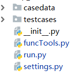
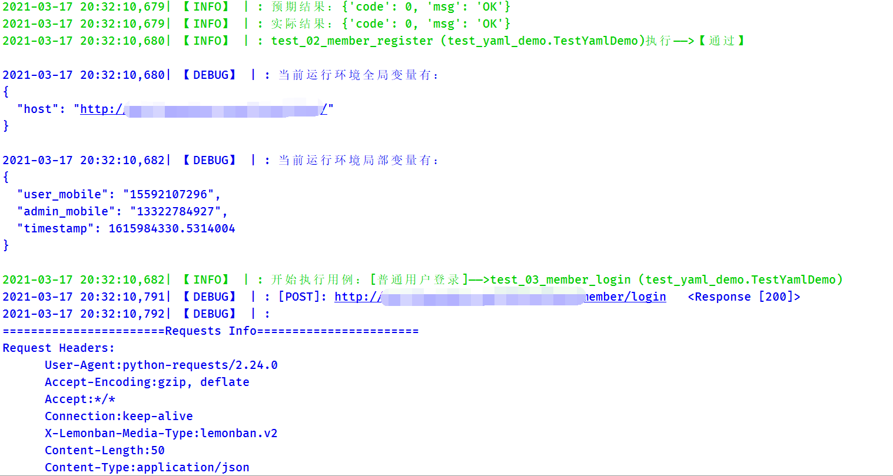
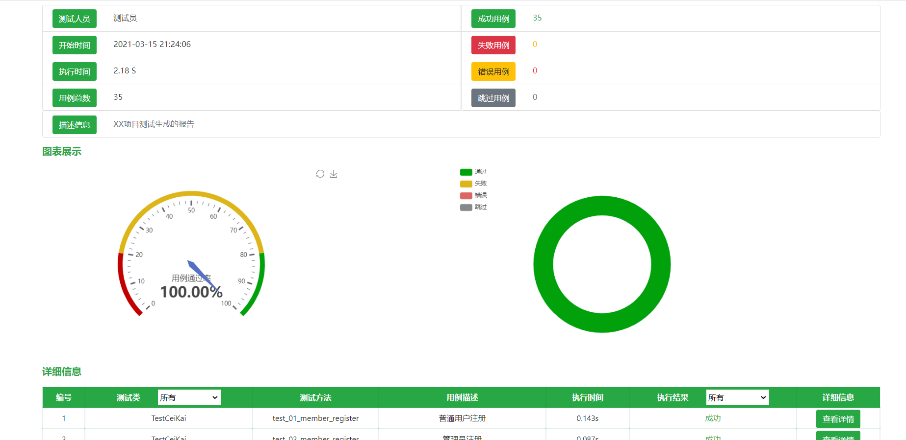

# 

## 1、项目创建

- **创建命令**

``` apin create 项目名```
    
安装好apin之后，打开命令终端输入创建命令，即可在当前路径下创建项目。
    
cd 切换到项目之中，即可看到如下的项目结构
    
  


- **项目文件说明**

    -  casedata: 存放yaml和json格式编写的用例文件

    -  testcases:py：存放py编写的用例目录

    -  func_tools.py：自定义的函数工具文件

    -  setting.py：整个项目的全局配置文件

    - run.py：项目运行入口文件

        

apin用例编写支持yaml文件，json文件，py文件三种方式，下面来快速了解一下三种用例编写的格式,

## 2、json编写用例


在项目的casedata目录下，定义一个以test开头的json文件，按照**【apin用例编写规范-json】**编写用例即可

```json
{
  "host": "http://api.XXX.com/futureloan/",
  "Cases": [
    {
      "title": "普通用户注册",
      "interface": "member/register",
      "method": "post",
      "json":{"mobile_phone":"133010121224","pwd":"lemonban"},
      "verification": []

    }
  ]
}
```


## 3、yaml编写用例

在项目的casedata目录下，定义一个以test开头的yaml文件，按照**【apin用例编写规范-yaml】**编写用例即可

```yaml
# 域名
host: http://api.XXX.com/futureloan/
# 用例数据
Cases:
  - title: 普通用户注册
    interface: member/register
    method: post
    json:
      mobile_phone: ${{user_mobile}}
      pwd: lemonban
```

​    

## 4、py文件编写用例

​	在testcases目录中定义一个以test开头的py文件，定义一个以Test开头的类，并且继承于apin.core.httptest.HttpCase类，按照**【apin用例编写规范-py**】编写用例即可


```python
from apin.core.httptest import HttpCase

class TestStreamV3(HttpCase):
    host = "http://api.XXX.com/futureloan/"
    Cases = [
        # 用例1：普通用户注册
        {
            'title': "普通用户注册",
            'interface': "member/register",
            "method": "post",
            'json': {"mobile_phone": "${{user_mobile}}", "pwd": "lemonban"},
        },
    ]
```

## 5、用例运行

- **方式1：**

     终端项目路径下输入命令: ```python apin run```
     
     

- **方式2**

     直接使用python运行项目的run.py文件


## 6、测试报告和日志

-  **日志：**项目运行完，会自动在项目路径下生成详细的运行日志

    

-  **测试报告：**apin的测试报告是基第三方库unittestreport生成的

     运行完会在项目目录的reports目录中，自动生成详细的html测试报告。

 


​    

